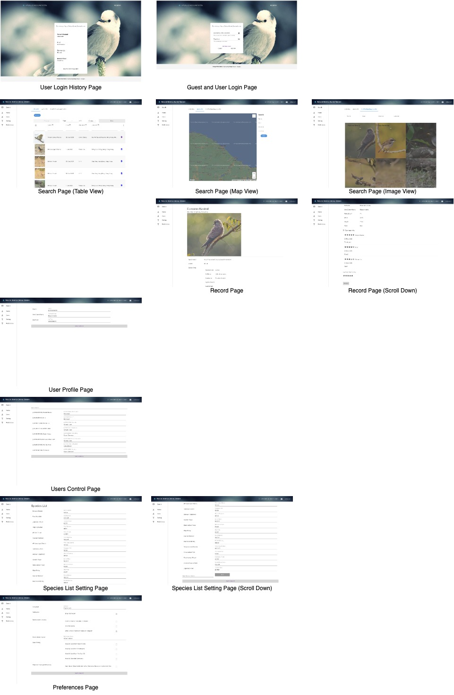
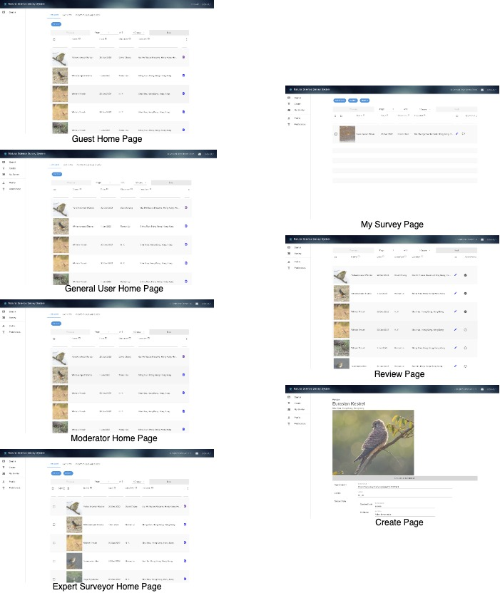
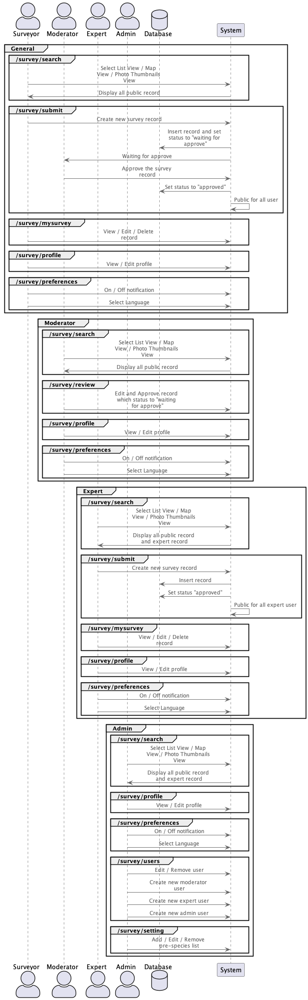
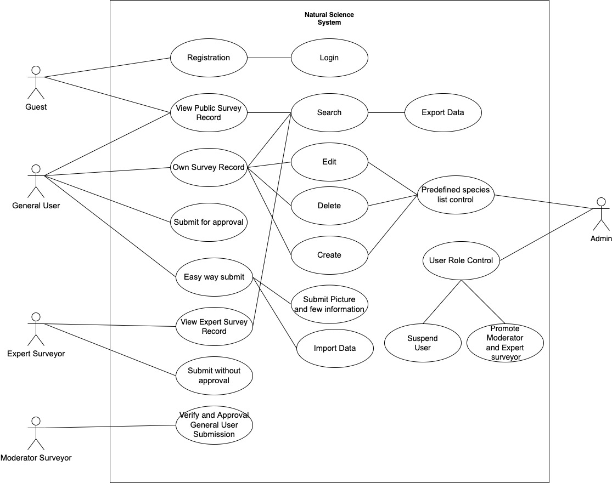

# Project Vision
The Natural Science Survey System is developing a comprehensive and consistent approach to surveying species records. Surveyors can have a reliable and easy way to document what they measure. Surveyors can share and search the system to help researchers track individual species and assess changes associated with specific specimens

To provide a cross-platform mobile application that is easy and reliable to use for any surveyor, nature lover, or the general public. It is a trustworthy system that keeps records shared by the users. The records are reviewed and approved by qualified surveyors to guarantee their authenticity. They can be searched to help track any individual species and compared for statistical purposes.

# Project Objectives

To provide a convenient and reliable way for the surveyors to keep records 
To provide a system that allows the common users to easily add records to enrich the database.
To provide a system that is easy to use and inspires people’s love for nature.

# Prototype

# Diagram
## Interaction Overview Diagram

## Use Case Diagram

